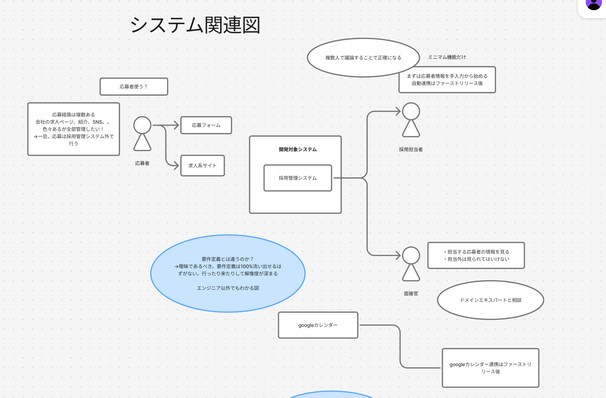
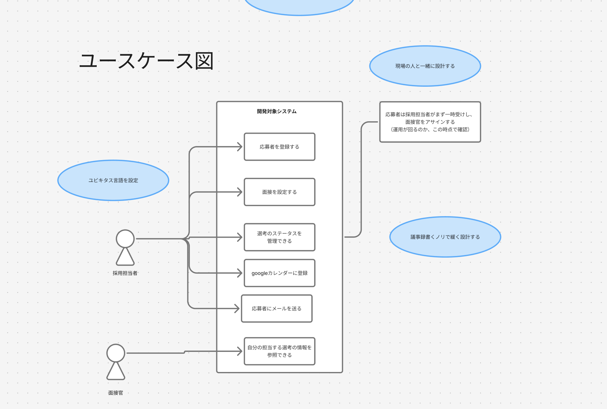
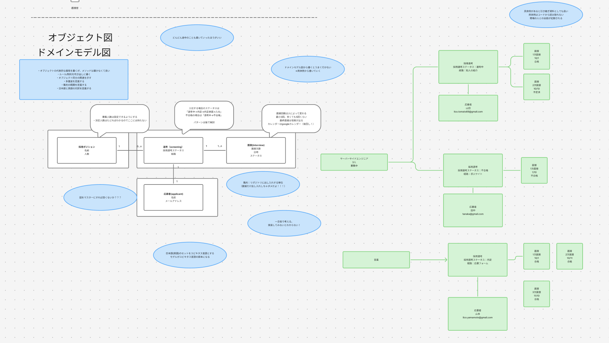

# DDD におけるモデリング

実装パターンはわかる。でもモデリング手法がわからない

→sudo モデリングを使おう！

モデリングの題材：採用管理システム

## システム関連図

システムが提供する機能と利用者・外部システムとの関係を表現する

```
要件定義とは異なるのか？
→曖昧にするべき。要件定義では100%仕様を洗い出せていないという前提のもと、実装の際に図を用いて解像度を上げていく
```



## ユースケース図

ユーザーの要求に対するシステムの振る舞いを定義する

```
- 議事録を書くノリで、会議の中でささっと作って意思決定のための参考資料にしていこう！
- 現場の人もわかる図なので、必要に応じて現場の人にも見てもらおう！
- ユビキタス言語が設定されたら、図の中の言葉も適宜変えていこう！図がマスタのつもりで、ずれが起きないように
```



## ドメインモデル図・オブジェクト図

オブジェクト間の連携や動作の流れを表現する

※具体から抽象に起こすほうが楽！→ オブジェクト図からドメインモデル図を作成していこう！

やること

```
- オブジェクトの代表的な属性を書くが、メソッドは書かなくて良い
- ルール/制約を吹き出しに書く
- オブジェクト同士の関連を示す
- 多重度を定義する
- 集約の範囲を定義する
- 日本語と英語の対訳を定義する
```



### フローチャート図

### ER 図
